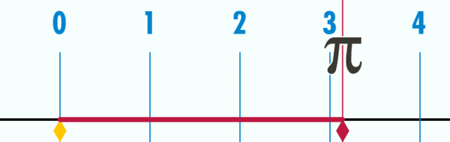
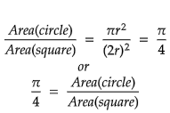
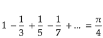

This is one of the oldest pi jokes: Mathematicians say, *“Pi r squared.”* Bakers say, *“Cakes are square. Pies are round.”*
The value of pi is 3 plus an infinite number of digits after the decimal point: ***3.14159265358979323846…***
>The famous mathematical constant **π**, the symbol used by mathematicians to represent the ratio of a *circle's circumference* to its
>*diameter* is the lowercase Greek letter **π**.In English, **π** is pronounced as ***pie***.

Before moving futher, fun fact **pi** is so huge that you may [find your Bithday within it](https://www.angio.net/pi/).
Computers have now calculated at least ***12 trillion*** digits for π.
Well for me the hunt started in school in our where we know **π** as 22/7 or 3.1415..., i never thought there is whole diffrent world running for those 3 dot(.).

For me this become more intresting when i came accross [***Why do colliding blocks compute pi?***](https://www.youtube.com/watch?v=jsYwFizhncE&t=789s),which is based on ***PLAYING POOL WITH π*** by **G. GALPERIN**, were he explains how digits of *PI* appear when two bodies collides to each other highly inefficient but fun way to MATHS.
Here are some of way which i find interesting.

### Natural Definition
Well as definition suggest that *ratio of a circle's circumference to its diameter*.
Or for simplification *The circumference of a circle with diameter 1 is π*. 

### Polygon Approximation
It is more geometrical approach using polygons for finding value of PI. 
For sake simplicity, lets get *circle inscribed in a square* such that diameter(say 2r) of circle is equal to side length of square.
Now from here we can say 

Here is a [simple simulation](http://) this. It might seems prommising but it take long to calculate significant digits by this method.

### Madhava–Leibniz series
As it is a special case of a more general series expansion for the inverse tangent function, first discovered by Sangamagrama, the specific case first published by Gottfried Leibniz.
Here is a [simple simulation](http://) which shows the convergence of infinite series for π.

Leibniz's formula converges extremely ***slowly***: it exhibits *sublinear convergence*. Calculating π to 10 correct decimal places using direct summation of the series requires about ***five billion terms***.
Also if the series is truncated at the right time, the decimal expansion of the approximation will agree with that of π for many more digits, except for isolated digits or digit group.

### Rapidly convergent series
All the above mention series are interesting and fun to play with but the quest for more digits calculation that are as **fast** as iterative algorithms, yet are **simpler** and **less memory intensive**, which is being possible when the mathematician ***Srinivasa Ramanujan*** published dozens of innovative new formulae for ***π***.
One of his formulae, based on *modular equations*, is
              

Scary yeah??? Seems like 🚀🚀 Rocket Scince 🚀🚀,but surprisingly, it show very prommising result in few iteration.
This series opens up new doors🚪 for the hunts of the ***three dots***(3.141...) and setting up new records.

- In 1989, *Chudnovsky brothers* computed π to over ***1 billion*** decimal places on the *supercomputer IBM 3090*.
- In 1999, *Yasumasa Kanada* and his team computed π to over ***200 billion*** decimal places on the *supercomputer HITACHI SR8000/MPP*.
- In August 2010, *Shigeru Kondo* calculate ***5 trillion*** digits of π, This was the world record for any type of calculation, later he broke his own record by computing ***ten trillion*** (10^13) and fifty digits.
- In January 2020 *Timothy Mullican* announced the computation of ***50 trillion*** digits over 303 days.

>***50 trillion*** digits, that is insane *😱😱😱* and seems to be *Rocket Scince*.
>I never thought that cute ***PI*** at school is a 😈 and hunt is on for it...
